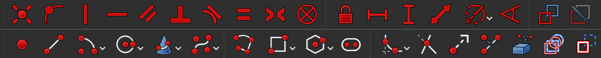

# Freecad_tutorial

## Introduction:

Welcome to this FreeCAD tutorial! FreeCAD is a powerful, open-source parametric 3D CAD modeler used for product design, mechanical engineering, architecture, and more. Its open-source nature makes it accessible to everyone, from hobbyists to professionals.

In this tutorial, you'll learn how to create 3D shapes starting with 2D sketches. We’ll cover essential operations like extrusion and revolving to transform your sketches into complex 3D models. Whether you’re a beginner or looking to enhance your skills, this guide will help you unlock the potential of FreeCAD. Let’s get started!

## How to Set Up FreeCad:

first go to this link and install the corrisponded Freecad verion for your computer.
[link](https://www.freecad.org/downloads.php)

Aftert that just open the file and go through the install process.

## How to Create a Sketch:

### Introduction to sketch making:

The way you create a body or a negative space needs to be based on a 2D sketch which can be created at different axes. To create a new project you need to first click on new, then on Create body. After that, you can click on “Create Sketch”. Then a canvas with the 2 2D axis and a center point will appear.

### Toolbar for sketches:

### Toolbar function details:

|Tool Name|Detail|
|:-:|:-:|
|dot   |The dot is defined by a point, to use it click on the function first than flick on the canvas inorder to place the dot. It is often use for adding measurements for some specific shapes.|
|line||
|arc||
